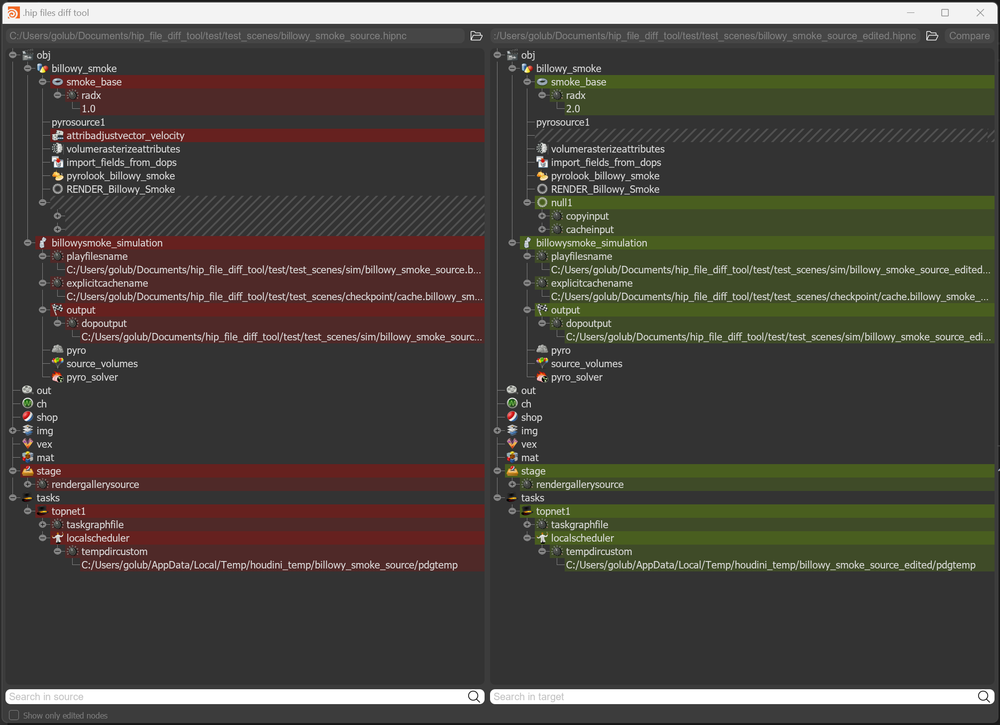

The Houdini Hipfile Diff Tool, a difference viewer tailored for Houdini project files using hython 3.9. 

This tool offers dual-view comparisons, visual indicators for changes, synchronized navigation, and a search feature. It's designed to streamline the process of tracking changes in Houdini projects. It is very similar to the git diff tool in a way, but it allows you to have a node tree view difference.

Given its reliance on Houdini libraries, ensure you launch this tool using Houdini's specific Python distribution, hython3.9, bundled with each Houdini release. Typically, you can locate it at: ".../Side Effects Software/Houdini 19.5.368/bin/hython3.9.exe".

To get started:
1. Clone the repository: git clone https://github.com/golubevcg/hip_file_diff_tool
2. Navigate to the repository folder and initiate the tool with Houdini's hython3.9: & ".../Side Effects Software/Houdini 19.5.368/bin/hython3.9.exe" .../hip_file_diff_tool/main.py (Ensure you replace '...' with the full path to hython and main.py)

For unit testing, execute:
hython3.9.exe -m unittest discover -p 'test*.py'
from the repository's root directory.
